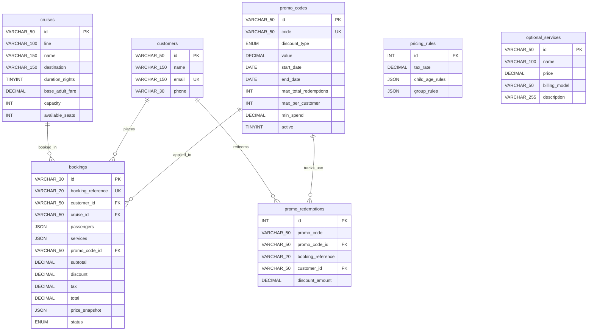

# Technical Approach — Cruise Booking System Assessment

This document provides a detailed overview of the system architecture, data model, business logic design, and implementation decisions for the Cruise Booking System.

---

## 1. Overview
The Cruise Booking System is a multi-step booking engine designed to handle voyage selection, traveller registration, dynamic pricing computation, promotional code validation, optional services configuration, and booking confirmation with atomic capacity locking. 

The system moves all authoritative calculations and rules (fares, discounts, taxes, promotional limits, and capacities) from the frontend to a Node.js/Express backend backed by a relational MySQL database.

---

## 2. Architecture
The application is built using a modern decoupled architecture:

*   **React Frontend**: A Single Page Application (SPA) built using React. It maintains UI state and acts as a pure presentation layer. It communicates with the backend via asynchronous `fetch` calls, updating the price breakdown in real-time as selections change.
*   **Express/Node.js Backend**: A RESTful API server that enforces business rules and handles requests. It hosts endpoints for fetching cruise options, validating coupons, generating quotes, and confirming bookings.
*   **MySQL Database**: A relational database storing cruises, pricing configurations, customers, promotions, redemptions, and bookings.
*   **Service Layer Structure**: The backend is organized around service components:
    *   [pricing.service.js](file:///c:/Users/275760/.gemini/antigravity-ide/scratch/cruise-booking-system/server/src/services/pricing.service.js): Handles age bands, optional service billing models, group discounts, and tax computation.
    *   [promotion.service.js](file:///c:/Users/275760/.gemini/antigravity-ide/scratch/cruise-booking-system/server/src/services/promotion.service.js): Evaluates coupon eligibility, expiration dates, minimum spends, and limits.
    *   [booking.service.js](file:///c:/Users/275760/.gemini/antigravity-ide/scratch/cruise-booking-system/server/src/services/booking.service.js): Executes transactional checkout, atomic capacity decrementing, reference generation, and persistence.
    *   *Note*: While directories for `models` and `repositories` exist in the server source directory, they are currently unused. Database queries are executed directly within the service layer using raw SQL queries via a connection pool for simplicity and execution speed.

### Request Flow
1.  **Selection**: The user selects a cruise or adjusts travellers/services in the React UI.
2.  **Quotation Request**: React POSTs the selection state to `/api/bookings/quote`.
3.  **Engine Evaluation**: The backend `pricing.service.js` queries `pricing_rules`, `optional_services`, and `cruises` from MySQL, calculates subtotals in integer cents, applies discounts/taxes, and returns a detailed JSON breakdown.
4.  **Confirmation Request**: The user clicks "Confirm & Lock Booking". React POSTs details to `/api/bookings`.
5.  **Transactional Execution**: The backend locks the target cruise row `FOR UPDATE`, verifies capacity, inserts or resolves the customer, applies the promotion, decrements available seats, generates a reference ID, logs promo redemption, and commits.
6.  **Success**: The frontend receives the finalized booking details and shows the confirmation screen.

---

## 3. Data Model
The database is structured into 7 core tables:

### Design Rationale
*   **JSON Columns**: Used in `pricing_rules` (`child_age_rules`, `group_rules`) to easily expand and store custom array parameters without creating complex join tables. Used in `bookings` (`passengers`, `services`, `price_snapshot`) to preserve historical configurations as they were at confirmation.
*   **Decoupled Redemptions**: The `promo_redemptions` table provides a lightweight tracking mechanism to easily run aggregations (`COUNT(*)`) for enforcing total and per-customer coupon usage limits.

---

## 4. Pricing Design
The pricing engine computes all items server-side inside `pricing.service.js`.

### Core Rules
1.  **Adult Fare**: Full price (100% of `base_adult_fare`). Passengers of age 18 and older are treated as adults.
2.  **Child Age Bands**: Retrieved dynamically from the `child_age_rules` JSON in `pricing_rules`. Currently seeded as:
    *   Age 0–4: 0% fare (free)
    *   Age 5–11: 50% fare
    *   Age 12–17: 75% fare
3.  **Group Discounts**: Applied based on the total passenger count (adults + children) matching bounds in `group_rules`. Currently seeded as:
    *   1–2 passengers: 0% discount
    *   3–4 passengers: 5% discount
    *   5–6 passengers: 10% discount
4.  **Optional Services**: Queried from `optional_services` and billed depending on their billing model:
    *   `per_passenger`: `price * passenger_count`
    *   `per_passenger_per_night`: `price * passenger_count * duration_nights`
    *   `per_booking`: Flat cost per transaction
5.  **Promotional Discount**: Applied to the pre-discount subtotal (discounted cruise fares + selected optional services subtotal).
6.  **Taxes & Port Fees**: A 12% mandatory tax applied directly to the taxable subtotal.

### Math Precision (Integer Cents)
To completely prevent floating-point rounding errors common in standard floating decimal math (e.g., `0.1 + 0.2 === 0.30000000000000004`), the pricing service converts all monetary values to **integer cents** (e.g., multiplying by 100 and rounding) at the start of calculations. All additions, divisions, and percentage multipliers are applied to cents. The final amounts are divided by 100 when saved to the MySQL database or returned as API payloads.

### Tax Calculation Order (Assumptions)
> [!NOTE]
> The assessment brief does not specify whether promotional coupons are applied before or after taxes. 
> 
> **Technical Assumption**: The system assumes promotional coupons are applied to the subtotal *before* calculating taxes. Therefore, the 12% tax rate is applied to the **taxable subtotal** (Pre-Promo Subtotal minus Promotional Discount), which ensures customers are only taxed on the actual amount they pay.

---

## 5. Booking & Capacity
Booking confirmation enforces strict safety validations inside a database transaction:

*   **Age and Size Boundaries**: A booking must contain at least 1 adult (age 18+) and cannot exceed 6 passengers total.
*   **Atomic Capacity Verification**:
    1.  Starts a transaction using `connection.beginTransaction()`.
    2.  Executes `SELECT available_seats, name FROM cruises WHERE id = ? FOR UPDATE`. This locks the specific cruise record, blocking concurrent write requests.
    3.  Verifies that `available_seats >= requested_seats`. If not, rolls back immediately to prevent overbooking.
    4.  Executes `UPDATE cruises SET available_seats = available_seats - ? WHERE id = ?` to decrease capacity safely.
*   **Booking Reference Generation**: Generates a random 6-character alphanumeric string prefixed with `CRZ-` (e.g., `CRZ-F3P7K2`). It verifies uniqueness against the `bookings` table inside the active transaction.

---

## 6. Promotion Design
The promotion system validates coupons against the database rules:

1.  **Coupon Rules**: Supports percentage-based deductions (e.g., `SUMMER10` for 10% off) and fixed discount bounds (e.g., `FIRST150` for $150 off).
2.  **Date Validity Check**: Assures `currentDate` is between `start_date` and `end_date`.
3.  **Minimum Spend**: Verifies pre-discount subtotal meets the coupon's `min_spend`.
4.  **Usage Limits**:
    *   **Max Total Uses**: Counts total rows matching the coupon in the `promo_redemptions` table to verify it does not exceed `max_total_redemptions`.
    *   **Max Per Customer**: Counts customer redemptions in `promo_redemptions` to verify it does not exceed `max_per_customer` (e.g., enforcing one-time use per customer).
5.  **Exclusivity**: Only one promotional code is accepted per booking. Commas, semicolons, or arrays are rejected by the validator.

---

## 7. Historical Price Preservation
To protect the financial audit trail from future price adjustments or rule changes, the system implements **Historical Price Preservation**:

When a booking is confirmed, a complete detailed copy of the pricing breakdown, calculations, and active business rules is saved into the `price_snapshot` JSON column in the `bookings` table. 

This snapshot includes:
*   A copy of the active child age percentages and group discount rate rules.
*   The exact base adult fares and service pricing rules at that time.
*   All computed subtotals, discounts, tax amounts, and totals.

If a cruise base fare is updated, a service is modified, or age bands are adjusted in `pricing_rules` later on, historical bookings remain completely unchanged and reconstructable.

---

## 8. Configurable Business Rules
The application's logic is fully database-driven:

*   **Fares**: Modifying the `base_adult_fare` in the `cruises` table updates new booking rates.
*   **Child Bands / Group Discounts / Tax Rates**: Contained in the `pricing_rules` table. Updating the JSON objects modifies age definitions or size discounts instantly without server restarts.
*   **Optional Services**: Adding or modifying rows in `optional_services` changes available add-ons.
*   **Promotions**: Creating new promo codes in `promo_codes` activates them immediately.

---

## 9. Stretch Goals
This section reports the status of stretch features:

*   **Rate Limiting**: *Not Implemented*. No rate limiting middleware is currently registered in `app.js` or configured.
*   **Monitoring**: *Not Implemented*. The system has a basic `/api/health` check endpoint, but lacks prometheus exporter integrations, custom metrics, or logging collectors.
*   **Logging**: *Basic Logging*. Uses standard Node.js `console.log` and `console.error` to track startup states, transactions, and errors. No external logging libraries (such as Winston, Winston-Express, or Morgan) are configured.

---

## 10. Important Decisions & Trade-offs
*   **Decoupled Services vs. Active Repository Layer**: The database operations are executed via direct query invocations in the service files rather than through a dedicated repository abstraction class. 
    *   *Trade-off*: Reduces codebase overhead, but increases service dependency on Raw SQL.
*   **Database-level Transaction Locking**: Chose MySQL table row-locking (`FOR UPDATE`) over application-level locks.
    *   *Trade-off*: Provides robust concurrency safety directly in the database engine, but can increase database wait times under high load.

---

## 11. What I Would Improve With More Time
1.  **Observability & Advanced Monitoring**: Add a standard logger like Winston to output structured JSON logs, and mount Prometheus exporters (`prom-client`) to track HTTP request frequencies and database connection statuses.
2.  **Rate Limiting Protection**: Register `express-rate-limit` middleware on critical paths (`/api/bookings`, `/api/promotions/validate`) to prevent denial-of-service attempts.
3.  **Object Relational Mapping (ORM) or Repository Layer**: Refactor the database code to use a formal repository layer (e.g., Knex.js or a clean query-builder pattern) to completely decouple the database driver from service-layer business logic.
